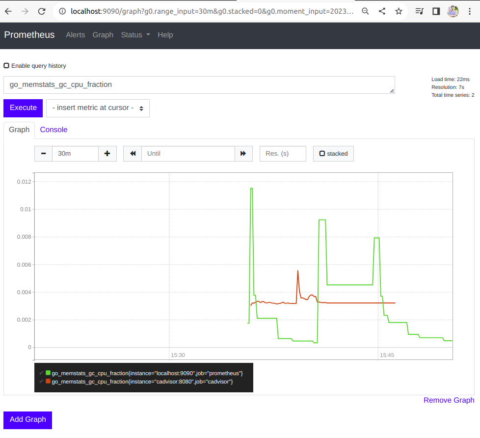
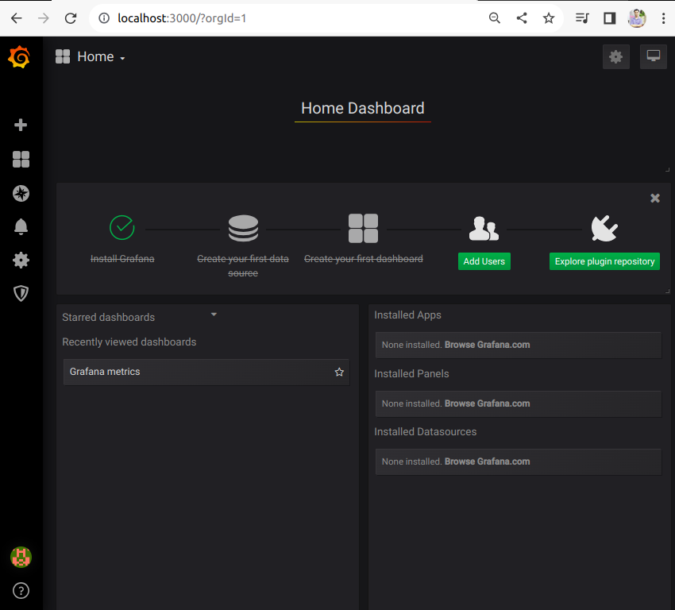
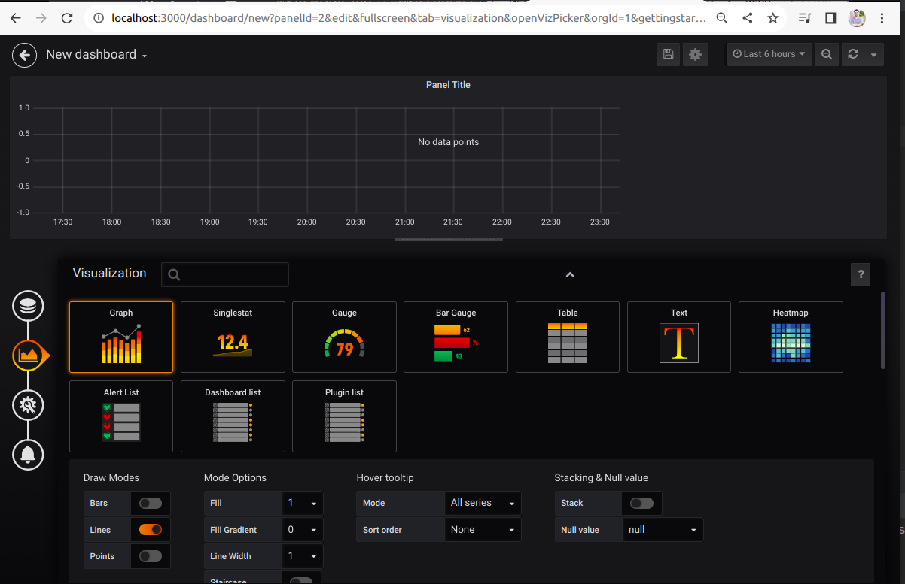

# Prometheus
Series về học Prometheus/ Demo thực tế<br/>
Các ví dụ liên quan đến Prometheus/Grafana từ cơ bản đến nâng cao<br/>
Mỗi nhánh trong Repo sẽ là 1 ví dụ/ giải pháp/ project mẫu trong Prometheus

# Môi trường phát triển
- Docker dành cho Prometheus
- Grafana để Visualize UI data
- Các service app triển khai trên nền Docker
- Các services/tools giao tiếp với services app, chẳng hạn như Kafka, RabbitMQ, DBs.

# Folder liên quan trên Windows
```
D:\Projects\prometheus
```

==============================================================

# Ví dụ [01.HelloWorld]
==============================================================

**Tham khảo**
- https://tothost.vn/prometheus-buoc-tien-vuot-troi-trong-giam-sat-he-thong/#Kien_truc_cua_Prometheus
- https://github.com/hocchudong/ghichep-prometheus/blob/master/1.Gioi_thieu_Prometheus.md
- https://github.com/hocchudong/ghichep-prometheus-v2/blob/master/docs/Overview.md
- https://viblo.asia/p/prometheus-la-gi-924lJ3805PM
- https://viblo.asia/p/gioi-thieu-ve-prometheus-cong-cu-monitoring-hieu-qua-Ljy5VYzblra

**Cài đặt Prometheus thông qua Docker Compose:**<br/>
```shell
01.docker-compose-prometheus.yaml
-----------------------------------------------------------------

version: '3.6'

# Server chính Prometheus
# Sử dụng file config ./prometheus-configs/prometheus.yml
#
# Các dữ liệu của Prometheus sẽ được lưu trữ trong ./prometheus-data
# Trong môi trường thử nghiệm, ta có thể setting full permission để tránh lỗi :
#   chmod 777 ./prometheus-data

services:
  prometheus:
    image: prom/prometheus:v2.12.0
    command:
      - --config.file=/prometheus-configs/prometheus.yml
    ports:
      - 9090:9090
    volumes:
      - ./prometheus-data:/prometheus
      - ./prometheus-configs:/prometheus-configs

    networks:
      - common-network

networks:
  common-network:
    external: true
    
```

**Cài đặt thêm 1 cAdvisor để giám sát:**<br/>
```shell
02.docker-compose-cAdvisor.yaml
-------------------------------------------------------------

version: '3.6'

services:
  cadvisor:
    image: google/cadvisor:latest
    volumes:
      - /:/rootfs:ro
      - /var/run:/var/run
      - /sys:/sys:ro
      - /var/lib/docker/:/var/lib/docker:ro
    ports:
      - 8008:8080

    networks:
      - common-network

networks:
  common-network:
    external: true
    
```

**Cài đặt Grafana để Visualize UI dữ liệu từ Prometheus:**<br/>
```shell
03.docker-compose-Grafana.yaml
-------------------------------------------------------------

version: '3.6'

# Grafana dùng để Visualize UI các metrics cần quan tâm một cách chi tiết hơn
#   so với Dashboard có sẵn của Prometheus ...
# Trong môi trường thử nghiệm, ta có thể setting full permission để tránh lỗi :
#   chmod 777 ./grafana-data

services:
  grafana:
    image: grafana/grafana:6.3.5
    ports:
      - 3000:3000
    environment:
      GF_SECURITY_ADMIN_PASSWORD: secret
    volumes:
      - ./grafana-data:/var/lib/grafana

    networks:
      - common-network

networks:
  common-network:
    external: true

```

**Thực thi các lệnh Docker Compose**<br/>
```shell
docker-compose -f 01.docker-compose-prometheus.yaml up -d
docker-compose -f 02.docker-compose-cAdvisor.yaml up -d
docker-compose -f 03.docker-compose-Grafana.yaml up -d 
```

**Một số hình ảnh kết quả:**<br/>
- Prometheus Server + cAdvisor:<br/>
  

- Grafana UI:<br/>
   <br/>

  
